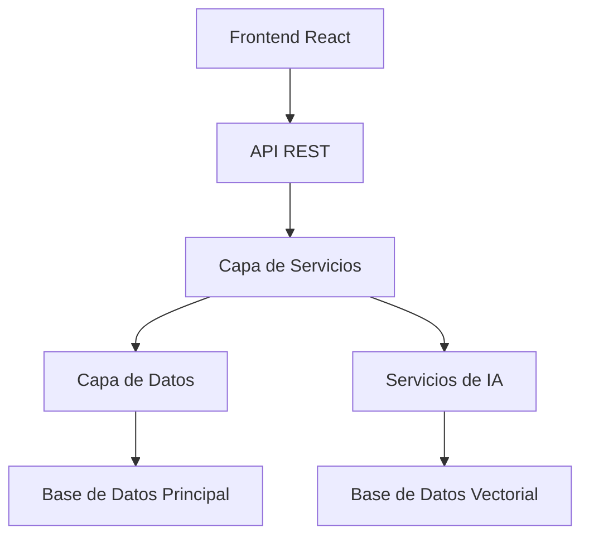

# Canvas Técnico del Sistema de Gestión de Inventario con IA

## 1. Arquitectura del Sistema

### 1.1 Capas de la Aplicación

### 1.2 Componentes Principales
- **Frontend**: React + Material-UI
- **Backend**: Flask + SQLAlchemy
- **Base de Datos**: SQLite (Dev) / PostgreSQL (Prod)
- **IA**: RAG + A2A + MCP
- **Cache**: Redis
- **Mensajería**: Redis Pub/Sub

## 2. Especificaciones Técnicas

### 2.1 Tecnologías Backend
- Python 3.9+
- Flask 2.3.3
- SQLAlchemy 2.0.23
- Flask-JWT-Extended 4.5.3
- Sentence-Transformers 2.2.2

### 2.2 Tecnologías Frontend
- React 18+
- Material-UI 5+
- Redux Toolkit
- Axios
- React Query

### 2.3 Base de Datos
- Modelos principales:
  - Users
  - Products
  - Inventory
  - Sales
  - Customers
- Modelos de IA:
  - ProductEmbeddings
  - DocumentEmbeddings

## 3. Funcionalidades del Sistema

### 3.1 Gestión de Inventario
- Control de stock
- Registro de movimientos
- Alertas de bajo stock
- Predicción de demanda

### 3.2 Búsqueda Inteligente
- Búsqueda semántica
- Recomendaciones contextuales
- Análisis de similitud

### 3.3 Automatización
- Monitoreo automático
- Pedidos automáticos
- Optimización de stock

### 3.4 Reportes
- Ventas
- Inventario
- Predicciones
- Rendimiento

## 4. Seguridad

### 4.1 Autenticación
- JWT
- Roles de usuario
- Sesiones seguras

### 4.2 Autorización
- RBAC (Role-Based Access Control)
- Permisos granulares
- Auditoría de acciones

### 4.3 Protección de Datos
- Encriptación en tránsito
- Encriptación en reposo
- Sanitización de entradas

## 5. Monitoreo y Mantenimiento

### 5.1 Métricas
- Rendimiento de API
- Uso de recursos
- Actividad de usuarios
- Rendimiento de IA

### 5.2 Logging
- Logs de aplicación
- Logs de seguridad
- Logs de IA
- Auditoría

### 5.3 Alertas
- Errores críticos
- Problemas de rendimiento
- Anomalías de seguridad
- Alertas de negocio

## 6. Escalabilidad

### 6.1 Horizontal
- Balanceo de carga
- Replicación de servicios
- Caché distribuido

### 6.2 Vertical
- Optimización de recursos
- Mejora de hardware
- Optimización de consultas

## 7. Integración y Despliegue

### 7.1 CI/CD
- GitHub Actions
- Tests automatizados
- Despliegue automático

### 7.2 Ambientes
- Desarrollo
- Pruebas
- Producción

## 8. Mantenimiento y Actualizaciones

### 8.1 Backups
- Base de datos
- Archivos
- Configuraciones

### 8.2 Actualizaciones
- Parches de seguridad
- Mejoras de funcionalidad
- Optimizaciones 